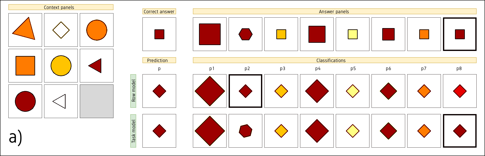
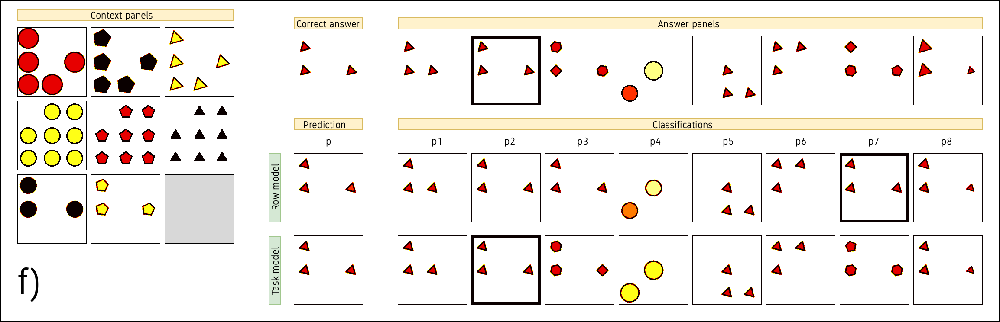

# Abstract Compositional Transformer (ACT)

This repository provides an implementation Abstract Compositional Transformer (ACT).
It was developed for research purposes by the Neurosymbolic Systems Lab at Poznan University of Technology.

[Live demo](https://huggingface.co/spaces/jkwiatkowski/raven)





Code for models and utilities is available in repositories:
- [core_tools](https://github.com/jakubkwiatkowski/core_tools.git)
- [grid_transformer](https://github.com/jakubkwiatkowski/compositional_transformer.git)
- [raven_utils](https://github.com/jakubkwiatkowski/raven_tools.git)

# Installation

You need pipenv to install the package. To install the package, run the following command:

```bash
pipenv install
```

# Usage

1. Property prediction
a. Train first phase - Task tokenizer with random masking

```bash
python main.py pp --phase "train" --tokenizer "task" --masking "random" --data_split "train" --save_weights "model/task_random" --epochs 200
```

b. Train second phase - Task tokenizer with last masking

```bash
python main.py pp --phase "train" --tokenizer "task" --masking "last" --data_split "train" --save_weights "model/task_last" --load_weights "model/task_random" --epochs 20
```

c. Evaluate model 

```bash
python main.py pp --phase "eval" --tokenizer "task" --masking "last" --data_split "test" --load_weights "model/task_last"
```

2. Choice maker

a. Eval DCM

```bash
python main.py 
```

Weights are available hear.
